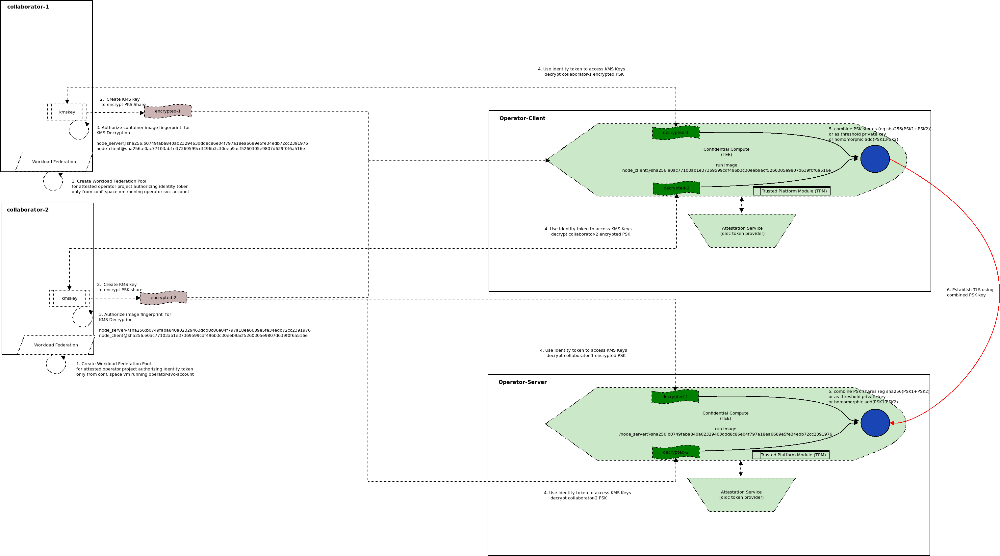
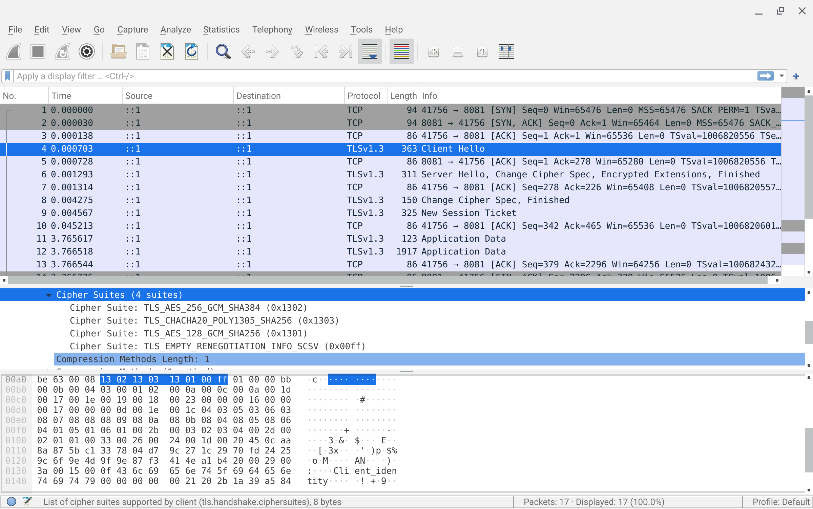
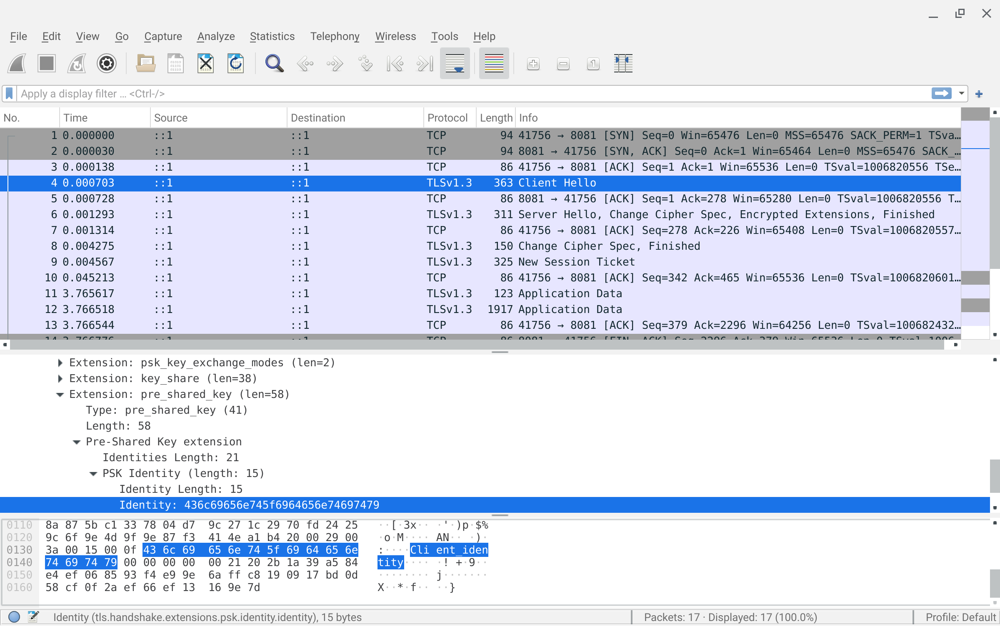
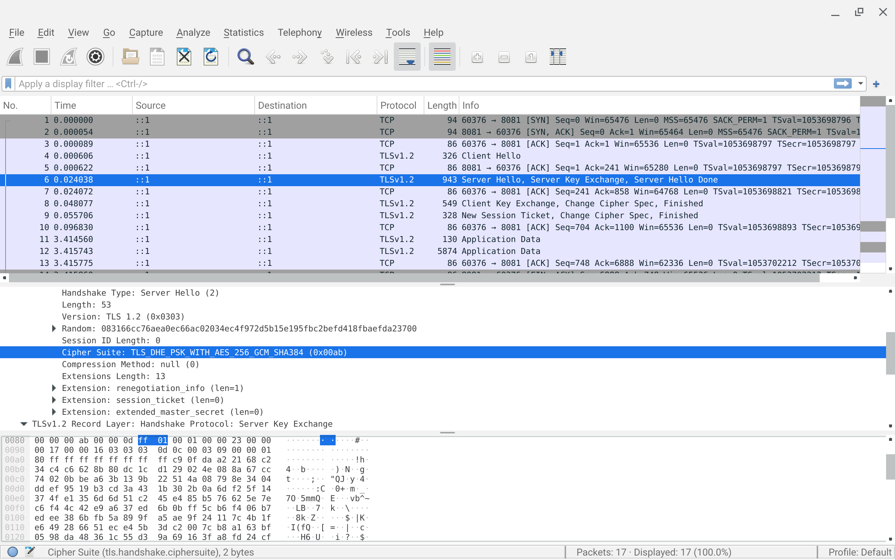
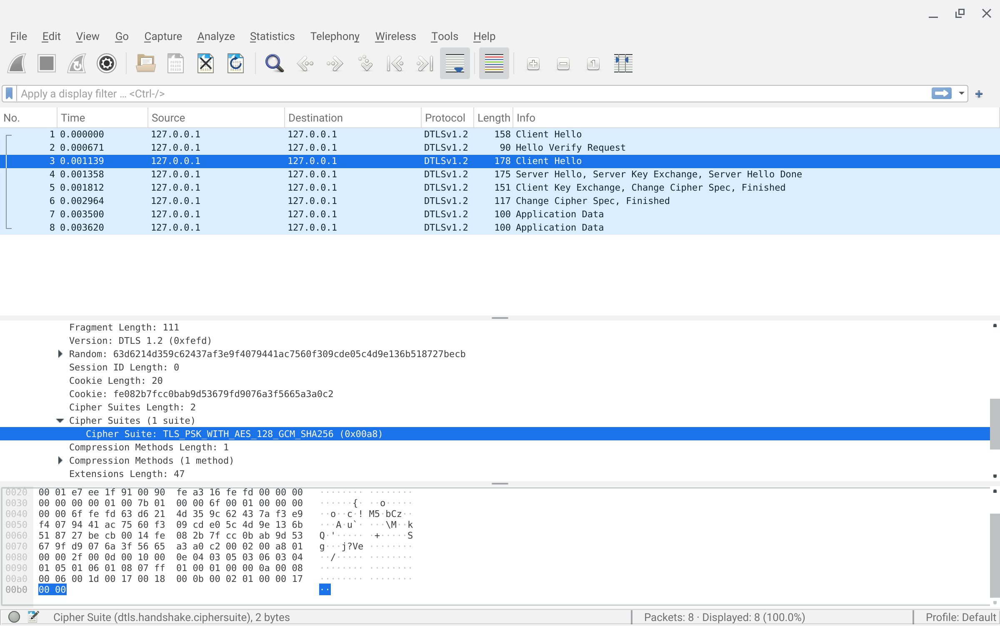

# Multiparty Consent Based Networks (MCBN)

Multiparty consent based networking (`mcbn`)is a mechanism with which a threshold of participants are required to establish distributed `client->server` connectivity using properties of `TLS` itself.

Its easier to describe in prose:

Suppose there are 

* three participants `Alice, Bob, Carol`
* two application components:  `client` and `server`
* the `client` can only connect to the `server` if all three participants agree to do so (or with a threshold of participants)
* `Frank` operates a compute infrastructure where the `client` and `server` run.
* each participant needs to provide their share of an encryption key which when combined will allow `client->server` connectivity
* `Frank` cannot have  the ability to see any other participants partial keys or final derived key (neither can the participants see the others)
* network traffic must be TLS encrypted (of course)

>>> **note**  all this is really experimental and just stuff i thought of; use caution

While there _maybe_ ways to achieve this programmatically using bearer tokens or `x509` certificates but they generally involve a trusted third party to broker secret.  

In this procedure outlined below, no trusted third party is required (well, you're trusting a provider of a TEE infrastructure (Google Cloud, Azure, AWS) that it is doing what its advertized to do as a TEE). 

Each participant will release their share of the secret to both the client and server only after ensuring the specific VM that is requesting the share is running in a  Trusted Execution Environment like [Google Confidential Space](https://cloud.google.com/blog/products/identity-security/announcing-confidential-space) and the codebase which is running is going to just use the combined keyshares to establish a TLS connection to the client and server.

Basically, the network connection itself is predicated on having access to all the keys for each participant in an environment where the codebase is trusted and `Frank` cannot access any data running on the VM.

All of this is achieved using fairly uncommon mechanisms built into `TLS` or seeding how private keys are generated:

- **TCP/UDP**: [Pre-shared Key TLS (PSK)](#pre-shared-key-tls-psk)

    A common `PSK` will be constructed within `Confidential Space` VM  using all participants keys (or with modification using `t-of-n` [Threshold Cryptography](https://gist.github.com/salrashid123/a871efff662a047257879ce7bffb9f13)).   The partial keys will be released to the VM only after _it proves_ to each participant it is running trusted code and the operator (`Frank`), cannot access the system.

    The combined keys will create the same PSK on both the client and server and and then facilitate network connectivity. 

    TCP - `TLS-PSK`:
    * [Pre-Shared Key Ciphersuites for Transport Layer Security (TLS)](https://www.rfc-editor.org/rfc/rfc4279)

    UDP - `DTLS with PSK`:
    * [Datagram Transport Layer Security Version 1.2](https://www.rfc-editor.org/rfc/rfc6347)


- **RSA**: [Deterministic RSA Key](#deterministic-rsa-key)

    The same RSA private key on both ends by "seeding" the shared key into the RSA key generator.  This allows each side to use that common RSA key to create a CSR and then have a local CA issue a TLS x509 certificate.
    Each end trusts the remote TLS cert and issuer but critical bit that is used to grant access is the _comparing the remote peers TLS certificates public key against the local key_.   
    Since each end uses the same RSA key, this comparison can ensure both ends recieved the same set of partial keys.

    TCP - `Shared RSA key derivation using constructed seeds`:
---

For  more information on confidential space, see

* [Constructing Trusted Execution Environment (TEE) with GCP Confidential Space](https://github.com/salrashid123/confidential_space)

Though we are referencing GCP `Confidential Space`, this technique can be used extended to connect multiple cloud providers.  For example, the threshold of keys can be decoded in a client running in [AWS Nitro Enclave](https://docs.aws.amazon.com/kms/latest/developerguide/services-nitro-enclaves.html) or [Azure SGX](https://learn.microsoft.com/en-us/azure/confidential-computing/confidential-computing-enclaves) while the server runs on GCP.




>>> **NOTE** this repo and sample is **not** supported by google. caveat emptor

---

## Combining Partial Keys

In all the examples below, we're going to "derive" the new key using a `sha256(alice+bob+carl)` which can certainly be more secure.

```javascript
const alice = '2c6f63f8c0f53a565db041b91c0a95add8913fc102670589db3982228dbfed90';
const bob = 'b15244faf36e5e4b178d3891701d245f2e45e881d913b6c35c0ea0ac14224cc2';               
const carol = '3e2078d5cd04beabfa4a7a1486bc626d679184df2e0a2b9942d913d4b835516c';
const key = crypto.createHash('sha256').update(alice+bob+carol).digest('hex');

//console.log(key);
// which is 
key = '6d1bbd1e6235c9d9ec8cdbdf9b32d4d08304a7f305f7c6c67775130d914f4dc4';

// alternatively, 
// successively chain keys with HMAC_SHA256(data,passphrase)
// key = HMAC_SHA256(HMAC_SHA256(alice,bob),carol)

// const k1 = crypto.createHmac('sha256', bob).update(alice).digest("hex");
// const key = crypto.createHmac('sha256', carol).update(k1).digest("hex");
// console.log(key);  // gives 2b6c5604e7b5a3a9832ec2590fd058d610807cee2f3e87bb08dafbb57475d976
```

Using `HMAC` or sha256 in these formats requires the known ordering of keys (though you could just `sha256(alice xor bob xor carl) == sha256(bob xor alice xor carl)` etc....and probably the assumption participants are not sending in degenerate keys like `000000...`.

Other realistic possibilities to derive can be some sort of KDF function or using `Threshold Cryptography` with  the final recovered [private key](https://gist.github.com/salrashid123/a871efff662a047257879ce7bffb9f13#file-main-go-L158).  (I haven't though much about the best way of how to derive a new key)

For alternatives see comments on [Proper way to combine multiple secrets into one HMAC key](https://security.stackexchange.com/questions/183344/proper-way-to-combine-multiple-secrets-into-one-hmac-key), [HKDF](https://security.stackexchange.com/questions/263842/key-derivation-for-hmac-concatenate-vs-multiple-hmac-passes) and [Combining Keys](https://crypto.stackexchange.com/questions/18572/combining-two-keys)

Anyway, we'll just go with the simple scheme above.

---

## Pre-shared Key TLS (PSK)

This sample uses `nodeJS` stack ask there are only a few languages that I've come across that do support PSK's:

other language support is  still in flight or i didn't care to learn java again

* `go`: [crypto/tls: add PSK support ](https://github.com/golang/go/issues/6379)
* `java`: [TlsPSKKeyExchange](https://www.bouncycastle.org/docs/tlsdocs1.8on/org/bouncycastle/tls/TlsPSKKeyExchange.html)
* `python`:  This repo also shows a very basic PSK client/server in python.  PSK support is only present as of python 3.13 ([#63284](https://github.com/python/cpython/issues/63284))

Anyway, the following hardcodes the derived key and simply sets up a client/server to demo PSK.

### PSK Server

To test locally, you can directly run the client and server.


```bash
cd server

## using node cli
npm i
node main.js

## run using bazel
#### run static
# bazel run :main

#### run image
# bazel run :server_image
# docker run -p 8081:8081 us-central1-docker.pkg.dev/builder-project/repo1/node_server
```

To generate the image with cloud build will result in the predictable hash of:

* `node_server@sha256:b0749faba840a02329463ddd8c86e04f797a18ea6689e5fe34edb72cc2391976`

This would be the image hash that is bound to `Confidential Space` server VM

```bash
cd psk/nodejs/server/

gcloud builds submit .

export PROJECT_ID=$(gcloud config list --format="value(core.project)")
docker pull  us-central1-docker.pkg.dev/$PROJECT_ID/repo1/node_server
docker inspect  us-central1-docker.pkg.dev/$PROJECT_ID/repo1/node_server
```

### PSK Client

To run the client,

```bash
cd client

## run using node cli
npm i
node main.js

## run using bazel
### run static
# bazel run :main

#### run image
# bazel run :image
# docker run --net=host us-central1-docker.pkg.dev/builder-project/repo1/node_client

## or just with openssl client
export PSK=6d1bbd1e6235c9d9ec8cdbdf9b32d4d08304a7f305f7c6c67775130d914f4dc4
openssl s_client -psk $PSK -psk_identity Client1 \
   -connect localhost:8081  -tls1_3
```

To generate the image with cloud build which will result in the predictable hash of:

* `node_client@sha256:e0ac77103ab1e37369599cdf496b3c30eeb9acf5260305e9807d639f0f6a516e`

This would be the image hash that is bound to `Confidential Space` server VM

```bash
cd psk/nodejs/client/
gcloud builds submit .

export PROJECT_ID=$(gcloud config list --format="value(core.project)")
docker pull  us-central1-docker.pkg.dev/$PROJECT_ID/repo1/node_client
docker inspect  us-central1-docker.pkg.dev/$PROJECT_ID/repo1/node_client
```

### Openssl TLS1_3

Openssl also support PSK based TLS. 

TLS1.3 reworked the cipher/ciphersuites to the following and which is open to all key exchange mechanism (including PSK even if not declared in the iana name)

```bash
$ openssl ciphers -v -s -tls1_3 -psk
   TLS_AES_256_GCM_SHA384  TLSv1.3 Kx=any      Au=any  Enc=AESGCM(256) Mac=AEAD
   TLS_CHACHA20_POLY1305_SHA256 TLSv1.3 Kx=any      Au=any  Enc=CHACHA20/POLY1305(256) Mac=AEAD
   TLS_AES_128_GCM_SHA256  TLSv1.3 Kx=any      Au=any  Enc=AESGCM(128) Mac=AEAD
```

As a demo, you can generate a new key or use the existing one

```bash
# to generate a new key
# openssl rand -hex 32

# or use the existing one:
export PSK=6d1bbd1e6235c9d9ec8cdbdf9b32d4d08304a7f305f7c6c67775130d914f4dc4
export PSK_HEX=`echo  -n $PSK |   xxd -p -c 64`

# start server
openssl s_server  -psk $PSK_HEX -nocert -accept 8081  -tls1_3 -www

# in a new window with the same PSK, run client
openssl s_client -psk $PSK_HEX -tls1_3 -connect localhost:8081

## once connected via client, make an HTTP request
# GET / HTTP/1.0
# <return>
# <return>

## or with full verbosity debug HTTP 
docker run --name server --net=host -p 8081 -v `pwd`/:/apps/ \
    -ti docker.io/salrashid123/openssl s_server -psk $PSK_HEX \
    -nocert -accept 8081  -tls1_3  \
         -tlsextdebug         -trace -www

## run client
docker run  --name client   --net=host  \
   -ti docker.io/salrashid123/openssl s_client -psk $PSK_HEX \
   -connect localhost:8081  -tls1_3  \
        -tlsextdebug         -trace

# to stop docker containers,
docker rm -f client server
```

For an example with openssl and c:

* [Openssl TLS-PSK sockets in C](https://gist.github.com/salrashid123/56f45cc54feae86014ecce16403a6c1a)


### Wireshark

The following decodes the PSK traffic using wireshark and openssl:

```bash
export PSK=6d1bbd1e6235c9d9ec8cdbdf9b32d4d08304a7f305f7c6c67775130d914f4dc4
export PSK_HEX=`echo  -n $PSK |   xxd -p -c 64`

# start server
openssl s_server  -psk $PSK_HEX  -nocert -accept 8081  -tls1_3  -www

# in a new window start the trace
sudo tcpdump -s0 -ilo -w psk.cap port 8081

# in a new window with the PSK env set, run the client 
openssl s_client -psk $PSK_HEX  -connect localhost:8081 \
   -tls1_3  -keylogfile=keylog.log

# shutdown the tcpdump trace and view the decoded data:
wireshark psk.cap -otls.keylog_file:`pwd`/psk_keylog.log


# for tls1.2, a sample trace is provided
wireshark psk_tls12.cap  -otls.keylog_file:`pwd`/keylog_tls12.log
```





The traces above used `TLS13`, for `TLS12` traces:



## stunnel

Stunnel also offers support to for PSK:

see [stunnel PSK](https://www.stunnel.org/auth.html)

as a simple example of a client-server, 

`client --> no TLS --> stunnel_client :7070 --> TLS-PSK --> stunnel_server :8081  --> no TLS --> python server: 8080`

```bash
# start any background server
python3 -m http.server 8080

# then in different windows, run the client and server stunnels
stunnel server.conf

stunnel client.conf 

# finally run the client
curl -v http://localhost:7070/
```


- `server`

```log
stunnel server.conf  

2024.01.02 09:33:29 LOG5[ui]: stunnel 5.71 on x86_64-pc-linux-gnu platform
2024.01.02 09:33:29 LOG5[ui]: Compiled with OpenSSL 3.0.10 1 Aug 2023
2024.01.02 09:33:29 LOG5[ui]: Running  with OpenSSL 3.2.0-beta1 26 Oct 2023
2024.01.02 09:33:29 LOG5[ui]: Update OpenSSL shared libraries or rebuild stunnel
2024.01.02 09:33:29 LOG5[ui]: Threading:PTHREAD Sockets:POLL,IPv6 TLS:ENGINE,OCSP,PSK,SNI
2024.01.02 09:33:29 LOG5[ui]: Reading configuration from file /home/srashid/Desktop/mcbn/stunnel/server.conf
2024.01.02 09:33:29 LOG5[ui]: UTF-8 byte order mark not detected
2024.01.02 09:33:29 LOG5[ui]: FIPS mode disabled
2024.01.02 09:33:29 LOG4[ui]: Insecure file permissions on psk.txt
2024.01.02 09:33:29 LOG5[ui]: OCSP: Server OCSP stapling is incompatible with PSK
2024.01.02 09:33:29 LOG5[ui]: Configuration successful
2024.01.02 09:33:29 LOG5[ui]: Binding service [PSK server] to :::8081: Address already in use (98)
2024.01.02 09:33:29 LOG5[per-day]: Updating DH parameters
2024.01.02 09:33:32 LOG7[0]: Service [PSK server] started
2024.01.02 09:33:32 LOG7[0]: Setting local socket options (FD=3)
2024.01.02 09:33:32 LOG7[0]: Option TCP_NODELAY set on local socket
2024.01.02 09:33:32 LOG5[0]: Service [PSK server] accepted connection from 127.0.0.1:53004
2024.01.02 09:33:32 LOG6[0]: Peer certificate not required
2024.01.02 09:33:32 LOG7[0]: TLS state (accept): before SSL initialization
2024.01.02 09:33:32 LOG7[0]: TLS state (accept): before SSL initialization
2024.01.02 09:33:32 LOG5[0]: Key configured for PSK identity "client1"
2024.01.02 09:33:32 LOG7[0]: Initializing application specific data for session authenticated
2024.01.02 09:33:32 LOG7[0]: Initializing application specific data for session authenticated
2024.01.02 09:33:32 LOG7[0]: Deallocating application specific data for session connect address
2024.01.02 09:33:32 LOG7[0]: SNI: no virtual services defined
2024.01.02 09:33:32 LOG7[0]: TLS state (accept): SSLv3/TLS read client hello
2024.01.02 09:33:32 LOG7[0]: TLS state (accept): SSLv3/TLS write server hello
2024.01.02 09:33:32 LOG7[0]: TLS state (accept): SSLv3/TLS write change cipher spec
2024.01.02 09:33:32 LOG7[0]: TLS state (accept): TLSv1.3 write encrypted extensions
2024.01.02 09:33:32 LOG7[0]: TLS state (accept): SSLv3/TLS write finished
2024.01.02 09:33:32 LOG7[0]: TLS state (accept): TLSv1.3 early data
2024.01.02 09:33:32 LOG7[0]: TLS state (accept): TLSv1.3 early data
2024.01.02 09:33:32 LOG7[0]: TLS state (accept): SSLv3/TLS read finished
2024.01.02 09:33:32 LOG7[0]:      1 server accept(s) requested
2024.01.02 09:33:32 LOG7[0]:      1 server accept(s) succeeded
2024.01.02 09:33:32 LOG7[0]:      0 server renegotiation(s) requested
2024.01.02 09:33:32 LOG7[0]:      1 session reuse(s)
2024.01.02 09:33:32 LOG7[0]:      0 internal session cache item(s)
2024.01.02 09:33:32 LOG7[0]:      0 internal session cache fill-up(s)
2024.01.02 09:33:32 LOG7[0]:      0 internal session cache miss(es)
2024.01.02 09:33:32 LOG7[0]:      0 external session cache hit(s)
2024.01.02 09:33:32 LOG7[0]:      0 expired session(s) retrieved
2024.01.02 09:33:32 LOG7[0]: Initializing application specific data for session authenticated
2024.01.02 09:33:32 LOG7[0]: Deallocating application specific data for session connect address
2024.01.02 09:33:32 LOG7[0]: Generate session ticket callback
2024.01.02 09:33:32 LOG7[0]: Initializing application specific data for session authenticated
2024.01.02 09:33:32 LOG7[0]: Deallocating application specific data for session connect address
2024.01.02 09:33:32 LOG7[0]: New session callback
2024.01.02 09:33:32 LOG6[0]: No peer certificate received
2024.01.02 09:33:32 LOG6[0]: Session id: CC433E3A83193DE52639EC14373B1EC6038D96B4D19F1FE30F3379933E8F33D9
2024.01.02 09:33:32 LOG7[0]: TLS state (accept): SSLv3/TLS write session ticket
2024.01.02 09:33:32 LOG6[0]: TLS accepted: new session negotiated
2024.01.02 09:33:32 LOG6[0]: TLSv1.3 ciphersuite: TLS_AES_128_GCM_SHA256 (128-bit encryption)
2024.01.02 09:33:32 LOG6[0]: Peer temporary key: X25519, 253 bits
2024.01.02 09:33:32 LOG7[0]: Compression: null, expansion: null
2024.01.02 09:33:32 LOG6[0]: Session id: CC433E3A83193DE52639EC14373B1EC6038D96B4D19F1FE30F3379933E8F33D9
2024.01.02 09:33:32 LOG5[0]: persistence: No cached address found
2024.01.02 09:33:32 LOG6[0]: failover: priority, starting at entry #0
2024.01.02 09:33:32 LOG6[0]: s_connect: connecting ::1:8080
2024.01.02 09:33:32 LOG7[0]: s_connect: s_poll_wait ::1:8080: waiting 10 seconds
2024.01.02 09:33:32 LOG7[0]: FD=6 events=0x2001 revents=0x0
2024.01.02 09:33:32 LOG7[0]: FD=10 events=0x2005 revents=0x1
2024.01.02 09:33:32 LOG3[0]: s_connect: connect ::1:8080: Connection refused (111)
2024.01.02 09:33:32 LOG6[0]: s_connect: connecting 127.0.0.1:8080
2024.01.02 09:33:32 LOG7[0]: s_connect: s_poll_wait 127.0.0.1:8080: waiting 10 seconds
2024.01.02 09:33:32 LOG7[0]: FD=6 events=0x2001 revents=0x0
2024.01.02 09:33:32 LOG7[0]: FD=10 events=0x2005 revents=0x201D
2024.01.02 09:33:32 LOG5[0]: s_connect: connected 127.0.0.1:8080
2024.01.02 09:33:32 LOG6[0]: persistence: 127.0.0.1:8080 cached
2024.01.02 09:33:32 LOG5[0]: Service [PSK server] connected remote server from 127.0.0.1:38658
2024.01.02 09:33:32 LOG7[0]: Setting remote socket options (FD=10)
2024.01.02 09:33:32 LOG7[0]: Option TCP_NODELAY set on remote socket
2024.01.02 09:33:32 LOG7[0]: Remote descriptor (FD=10) initialized
2024.01.02 09:33:32 LOG6[0]: Read socket closed (readsocket)
2024.01.02 09:33:32 LOG7[0]: Sending close_notify alert
2024.01.02 09:33:32 LOG7[0]: TLS alert (write): warning: close notify
2024.01.02 09:33:32 LOG6[0]: SSL_shutdown successfully sent close_notify alert
2024.01.02 09:33:32 LOG7[0]: TLS alert (read): warning: close notify
2024.01.02 09:33:32 LOG6[0]: TLS closed (SSL_read)
2024.01.02 09:33:32 LOG7[0]: Sent socket write shutdown
2024.01.02 09:33:32 LOG5[0]: Connection closed: 543 byte(s) sent to TLS, 77 byte(s) sent to socket
2024.01.02 09:33:32 LOG7[0]: Deallocating application specific data for session connect address
2024.01.02 09:33:32 LOG7[0]: Remote descriptor (FD=10) closed
2024.01.02 09:33:32 LOG7[0]: Local descriptor (FD=3) closed
2024.01.02 09:33:32 LOG7[0]: Service [PSK server] finished (0 left)
```

- `client`

```log
stunnel client.conf 

2024.01.02 09:33:23 LOG5[ui]: stunnel 5.71 on x86_64-pc-linux-gnu platform
2024.01.02 09:33:23 LOG5[ui]: Compiled with OpenSSL 3.0.10 1 Aug 2023
2024.01.02 09:33:23 LOG5[ui]: Running  with OpenSSL 3.2.0-beta1 26 Oct 2023
2024.01.02 09:33:23 LOG5[ui]: Update OpenSSL shared libraries or rebuild stunnel
2024.01.02 09:33:23 LOG5[ui]: Threading:PTHREAD Sockets:POLL,IPv6 TLS:ENGINE,OCSP,PSK,SNI
2024.01.02 09:33:23 LOG5[ui]: Reading configuration from file /home/srashid/Desktop/mcbn/stunnel/client.conf
2024.01.02 09:33:23 LOG5[ui]: UTF-8 byte order mark not detected
2024.01.02 09:33:23 LOG5[ui]: FIPS mode disabled
2024.01.02 09:33:23 LOG4[ui]: Insecure file permissions on psk.txt
2024.01.02 09:33:23 LOG5[ui]: Configuration successful
2024.01.02 09:33:32 LOG7[0]: Service [PSK client 1] started
2024.01.02 09:33:32 LOG7[0]: Setting local socket options (FD=3)
2024.01.02 09:33:32 LOG7[0]: Option TCP_NODELAY set on local socket
2024.01.02 09:33:32 LOG5[0]: Service [PSK client 1] accepted connection from 127.0.0.1:44210
2024.01.02 09:33:32 LOG6[0]: s_connect: connecting 127.0.0.1:8081
2024.01.02 09:33:32 LOG7[0]: s_connect: s_poll_wait 127.0.0.1:8081: waiting 10 seconds
2024.01.02 09:33:32 LOG7[0]: FD=6 events=0x2001 revents=0x0
2024.01.02 09:33:32 LOG7[0]: FD=10 events=0x2005 revents=0x0
2024.01.02 09:33:32 LOG5[0]: s_connect: connected 127.0.0.1:8081
2024.01.02 09:33:32 LOG5[0]: Service [PSK client 1] connected remote server from 127.0.0.1:53004
2024.01.02 09:33:32 LOG7[0]: Setting remote socket options (FD=10)
2024.01.02 09:33:32 LOG7[0]: Option TCP_NODELAY set on remote socket
2024.01.02 09:33:32 LOG7[0]: Remote descriptor (FD=10) initialized
2024.01.02 09:33:32 LOG6[0]: SNI: sending servername: localhost
2024.01.02 09:33:32 LOG6[0]: Peer certificate not required
2024.01.02 09:33:32 LOG7[0]: TLS state (connect): before SSL initialization
2024.01.02 09:33:32 LOG7[0]: Initializing application specific data for session authenticated
2024.01.02 09:33:32 LOG6[0]: PSK client configured for identity "client1"
2024.01.02 09:33:32 LOG7[0]: Initializing application specific data for session authenticated
2024.01.02 09:33:32 LOG7[0]: TLS state (connect): SSLv3/TLS write client hello
2024.01.02 09:33:32 LOG7[0]: TLS state (connect): SSLv3/TLS write client hello
2024.01.02 09:33:32 LOG7[0]: Deallocating application specific data for session connect address
2024.01.02 09:33:32 LOG7[0]: Initializing application specific data for session authenticated
2024.01.02 09:33:32 LOG7[0]: Deallocating application specific data for session connect address
2024.01.02 09:33:32 LOG7[0]: TLS state (connect): SSLv3/TLS read server hello
2024.01.02 09:33:32 LOG7[0]: TLS state (connect): TLSv1.3 read encrypted extensions
2024.01.02 09:33:32 LOG7[0]: OCSP stapling: Client callback called
2024.01.02 09:33:32 LOG6[0]: OCSP: Certificate chain verification disabled
2024.01.02 09:33:32 LOG7[0]: TLS state (connect): SSLv3/TLS read finished
2024.01.02 09:33:32 LOG7[0]: TLS state (connect): SSLv3/TLS write change cipher spec
2024.01.02 09:33:32 LOG7[0]: TLS state (connect): SSLv3/TLS write finished
2024.01.02 09:33:32 LOG7[0]:      1 client connect(s) requested
2024.01.02 09:33:32 LOG7[0]:      1 client connect(s) succeeded
2024.01.02 09:33:32 LOG7[0]:      0 client renegotiation(s) requested
2024.01.02 09:33:32 LOG7[0]:      1 session reuse(s)
2024.01.02 09:33:32 LOG6[0]: TLS connected: previous session reused
2024.01.02 09:33:32 LOG6[0]: TLSv1.3 ciphersuite: TLS_AES_128_GCM_SHA256 (128-bit encryption)
2024.01.02 09:33:32 LOG6[0]: Peer temporary key: X25519, 253 bits
2024.01.02 09:33:32 LOG7[0]: Compression: null, expansion: null
2024.01.02 09:33:32 LOG6[0]: Session id: 
2024.01.02 09:33:32 LOG7[0]: TLS state (connect): SSL negotiation finished successfully
2024.01.02 09:33:32 LOG7[0]: TLS state (connect): SSL negotiation finished successfully
2024.01.02 09:33:32 LOG7[0]: Initializing application specific data for session authenticated
2024.01.02 09:33:32 LOG7[0]: Deallocating application specific data for session connect address
2024.01.02 09:33:32 LOG7[0]: New session callback
2024.01.02 09:33:32 LOG6[0]: No peer certificate received
2024.01.02 09:33:32 LOG6[0]: Session id: 3516C349057726CF3DD75503386706AE95FE08AEBCC4E2DFDB5BA2D0AD0424DC
2024.01.02 09:33:32 LOG7[0]: TLS state (connect): SSLv3/TLS read server session ticket
2024.01.02 09:33:32 LOG7[0]: TLS alert (read): warning: close notify
2024.01.02 09:33:32 LOG6[0]: TLS closed (SSL_read)
2024.01.02 09:33:32 LOG7[0]: Sent socket write shutdown
2024.01.02 09:33:32 LOG6[0]: Read socket closed (readsocket)
2024.01.02 09:33:32 LOG7[0]: Sending close_notify alert
2024.01.02 09:33:32 LOG7[0]: TLS alert (write): warning: close notify
2024.01.02 09:33:32 LOG6[0]: SSL_shutdown successfully sent close_notify alert
2024.01.02 09:33:32 LOG5[0]: Connection closed: 77 byte(s) sent to TLS, 543 byte(s) sent to socket
2024.01.02 09:33:32 LOG7[0]: Remote descriptor (FD=10) closed
2024.01.02 09:33:32 LOG7[0]: Local descriptor (FD=3) closed
2024.01.02 09:33:32 LOG7[0]: Service [PSK client 1] finished (0 left)
```

---

## Datagram TLS (DTLS)


For UDP based traffic, we will use [Datagram Transport Layer Security Version 1.2](https://www.rfc-editor.org/rfc/rfc6347) and the `pion` go library here which supports `PSK`:
 
* [pion SDK for DTLS](https://github.com/pion/dtls/#using-with-psk)


### Openssl

As a prelimanary demo using openssl PSK while using tcpdump and keylogging,

```bash
export PSK=6d1bbd1e6235c9d9ec8cdbdf9b32d4d08304a7f305f7c6c67775130d914f4dc4
export PSK_HEX=`echo  -n $PSK |   xxd -p -c 64`

openssl s_server  -dtls1_2 -psk_identity Client1 \
   -psk $PSK_HEX -cipher PSK-AES128-CCM8  -nocert -accept 8081

# sudo tcpdump -s0 -ilo -w psk.cap port 8081

openssl s_client -dtls1_2 -psk_identity Client1 \
      -connect 127.0.0.1:8081 -psk $PSK -cipher PSK-AES128-CCM8 -keylogfile=dtls_keylog.log

wireshark dtls.cap -otls.keylog_file:`pwd`/dtls_keylog.log
```

The trace would look like this for dtls



### DTLS Server

Now similar to the TLS-PSK, we can run the client/server locally and then followup with a bazel build so that someday we can deploy to `Confidential Space`

```bash
# run server locally
go run server/server.go

## or with bazel
## optionally regenerate bazel go dependency
# bazel run :gazelle -- update-repos -from_file=go.mod -prune=true -to_macro=repositories.bzl%go_repositories

## to run using bazel
# bazel run --platforms=@io_bazel_rules_go//go/toolchain:linux_amd64 server:server 

## or generate container image locally
# bazel run  --platforms=@io_bazel_rules_go//go/toolchain:linux_amd64 server:dtls_server_image

## run server image from bazel
# docker run --net=host -p 8081:8081 us-central1-docker.pkg.dev/builder-project/repo1/dtls_server/server:dtls_server_image
```

To generate the image with cloud build which will result in the predictable hash of:

* `dtls_server@sha256:ac99f049143b03a2934753ec73141e0e72e8e42a4f5012f462ebe628fd55ff9d`
* `dtls_client@sha256:aa4a078fc357ae679d0790a3161d7bcb09a4b3a3d9f2d9e02286edb76de86ab5`


```bash
gcloud builds submit .

export PROJECT_ID=$(gcloud config list --format="value(core.project)")

docker pull us-central1-docker.pkg.dev/$PROJECT_ID/repo1/dtls_client
docker pull us-central1-docker.pkg.dev/$PROJECT_ID/repo1/dtls_server
docker inspect us-central1-docker.pkg.dev/$PROJECT_ID/repo1/dtls_server
docker inspect us-central1-docker.pkg.dev/$PROJECT_ID/repo1/dtls_client
```

### DTLS Client

To run the client 

```bash
# to run locally

go run client/client.go

## or with bazel
## optionally regenerate bazel go dependency
# bazel run :gazelle -- update-repos -from_file=go.mod -prune=true -to_macro=repositories.bzl%go_repositories

# run client locally
# bazel run --platforms=@io_bazel_rules_go//go/toolchain:linux_amd64 client:client 

## to generate container image locally
# bazel run  --platforms=@io_bazel_rules_go//go/toolchain:linux_amd64 client:dtls_client_image
## to run the client image from bazel
# docker run --net=host us-central1-docker.pkg.dev/builder-project/repo1/dtls_client/client:dtls_client_image
```

## Deterministic RSA Key

This technique basically uses both alice and bob's key together to derive the 'seed' value to use during RSA key generation.

If the same partial keys are used with a hash or KDF function that results in the same seed value, that seed value can be the "randomness" that is fed into [rsa.GenerateKey(random io.Reader, bits int) (*PrivateKey, error)](https://pkg.go.dev/crypto/rsa#GenerateKey).

Basically, you're feeding the function above a _deterministic random key_ (right...)

Its best demonstrated with the following using `certtool`:

```bash
# start with a pair of secret keys
export alice=b06394e28c33be5a8699759023972e9294d51b5007b3b0a51a41e9f58d406f8d
export bob=2d362ce19a804d12b85644abf3a0e9bbfbb0e0ba3c5dd7cc4b8e335bc5154496

# generate a new one...i'm using something suspect here like just hashing the combined key...there's certainly better ways like KDF or something

export S1=`echo -n "$alice$bob" | sha256sum | cut -d ' ' -f 1`
echo $S1

# you should see   cb488e9105faa7e26cf30dcc6042fea07fd71c38953973c356d8ecf80421880e
# now use that key as the 'seed' to generate a keypari and extract the RSA public keys
certtool --generate-privkey --outfile priv1.pem --key-type=rsa --sec-param=medium --provable --seed=$S1
openssl rsa -in priv1.pem -pubout -out pub1.pem
openssl rsa -pubin -in pub1.pem -RSAPublicKey_out

-----BEGIN RSA PUBLIC KEY-----
MIIBCgKCAQEAsv9SPzFfsbJ/a2509qwgCJlEW6c66k7nVJssjpZnK/cwXA8L8wJ6
TwtlNackAuxxUFNGeTzBvCOWGRdKkAB/zPTfbfk+P+VoduRFARH1/LbBaYHCkdYr
3qHVpdYOoYL7QVaDFMZt3crtzqLqX6coV8CyCl2F+7XIgoZ7feghMsUpgRJ1i/Cb
oVJPnjmKL4nlRtbuQjvHB4eEbOXb4qXPVu/tm8nBzsCMYrfvdzh4Luiqzi6kBcKs
Fh8wgt77loNAY084sVNpqf1pTnJNozR9PP/U0aHsopmSdcbvwsudZBJ7E1wqDX/o
mefpnh5OhJUFQOihjFxNKO5kdHgOYBsCnwIDAQAB
-----END RSA PUBLIC KEY-----


$ certtool  --verify-provable-privkey --load-privkey priv1.pem --seed=$S1
Key was verified
```


For more info, see:

* [Deterministic Random Bit Generator (DRBG)](https://csrc.nist.gov/publications/detail/sp/800-90a/rev-1/final)
* [Generating a public/private key pair using an initial key](https://stackoverflow.com/questions/18264314/generating-a-public-private-key-pair-using-an-initial-key)
* [How many random bits are required to create one RSA key](https://crypto.stackexchange.com/questions/53124/how-many-random-bits-are-required-to-create-one-rsa-key)
* [How to derive a private/public keypair from a random seed](https://crypto.stackexchange.com/questions/81487/how-to-derive-a-private-public-keypair-from-a-random-seed)
* [Making OpenSSL generate deterministic key](https://stackoverflow.com/questions/22759465/making-openssl-generate-deterministic-key)
* [Using Go deterministically generate RSA Private Key with custom io.Reader](https://stackoverflow.com/questions/74869997/using-go-deterministicly-generate-rsa-private-key-with-custom-io-reader)
* [How can one securely generate an asymmetric key pair from a short passphrase?](https://crypto.stackexchange.com/questions/1662/how-can-one-securely-generate-an-asymmetric-key-pair-from-a-short-passphrase/1665#1665)
* [Golang: A tool to generate a deterministic RSA keypair from a passphrase.](https://github.com/joekir/deterministics)
* [Python: deterministic-rsa-keygen 0.0.1](https://pypi.org/project/deterministic-rsa-keygen/)
* [Stackexchange: Proper way to combine multiple secrets into one HMAC key](https://security.stackexchange.com/questions/183344/proper-way-to-combine-multiple-secrets-into-one-hmac-key)


This repo contains a small demo about this feature that i extended for mTLS:

1. client and server recieve alice and bob's secret keys
2. client and server derive the same RSA key using a hash of partial keys
3. client and server uses the RSA key to create a CSR
4. client and server uses *any* CA to issue an x509 certificate for the CSR
5. server starts mTLS http server  where it accepts certificates issued by the remote peers CA.
6. client contacts the server using its local client certificate and accepts the server's cert issued by its peers CA
7. During connection establishment, both the client and server checks if the remote peer's leaf **RSA public key** is the same the local copy.

You'll notice the code contains a local CA keypair that is built into the sample...the CA only plays a bit part in this picture..

the 'thing' that allows connection isn't the CA or the certificate it signed (that bit is just for ease of use for mTLS)...the critical bit occurs when each end compares the RSA peer certificates are the same or not.

note, you could also conceive of a common public CA signer service which only accepts CSRs where the public rsa key is of the expected value (i.,e will only issue client or server certs to CSRs originating from a TEE)

This repo uses [Deterministic Random Bit Generator (DRBG)](https://csrc.nist.gov/publications/detail/sp/800-90a/rev-1/final) implemented through [github.com/canonical/go-sp800.90a-drbg](https://pkg.go.dev/github.com/canonical/go-sp800.90a-drbg#NewHash) to generate the deterministic rsa key.

For example:

```golang
import (
    drbg "github.com/canonical/go-sp800.90a-drbg"
)

    combinedKey := "y0iOkQX6p-Js8w3MYEL-oH_XHDiVOXPDVtjs-AQhiA4"
    r, err := drbg.NewHashWithExternalEntropy(crypto.SHA256, []byte(combinedKey), nil, nil, nil)
    privkey, err := rsa.GenerateKey(r, bitSize)
```

(note you can also use [crypto.ed25519.NewKeyFromSeed()](https://pkg.go.dev/crypto/ed25519@go1.20.5#NewKeyFromSeed))

The following shows a simple client-server where each participants keys are set

The first step shows the derived key, then the RSA key and the RSA key's hash value.  This should be the same on both ends.

Once the client makes mTLS contact, it will accept the mTLS connection if it they peer was signed by a common 

```bash
## server
$ go run server/server.go  \
  --alice=b06394e28c33be5a8699759023972e9294d51b5007b3b0a51a41e9f58d406f8d \
  --bob=2d362ce19a804d12b85644abf3a0e9bbfbb0e0ba3c5dd7cc4b8e335bc5154496

derived combined key y0iOkQX6p-Js8w3MYEL-oH_XHDiVOXPDVtjs-AQhiA4
-----BEGIN RSA PUBLIC KEY-----
MIIBCgKCAQEAynV1FFgMBUCoYlttNejPqb1zPAY1cQjkdOsghr7az+NHYxFmrCsc
0mkuXhRqf0QqeVJUNjbFdEVb9+lL3xuT59XucIZ5tpBlmIlcmRnX/7UeJToE9ZGX
ZVl2U3nEroUPcsAA5PH2vs/bPN19U0ekMq1mqCtb0P0/Jhtbk01HfmKmUovTh0oo
rRolK37dgGgqUo/FVs0Mw4kKYNd0Z3SqKVMigj7EmwN9Ng5GO01VBjsBrA1w146Z
VWca3/yGfOHsdY6oRgy5q/qxUfK2FKddCNLojR2xOllj4Y3K7Hli9cjBoEQvHy/K
bpFcvTcF8Qr3TVTkOJYbmW2rauvUSGqg3wIDAQAB
-----END RSA PUBLIC KEY-----

derived common certificate hash w55b4-JhIH7vLIoKJtilo8zS_QQkiXpLkkdILxqfLCA
Creating CSR
Creating Cert
Issued x509 with serial number 304644566552857710712497793020376072793
Starting Server..
derived and remote certificate hash match w55b4-JhIH7vLIoKJtilo8zS_QQkiXpLkkdILxqfLCA


## client
$ go run client/client.go \
  --alice=b06394e28c33be5a8699759023972e9294d51b5007b3b0a51a41e9f58d406f8d \
  --bob=2d362ce19a804d12b85644abf3a0e9bbfbb0e0ba3c5dd7cc4b8e335bc5154496

derived combined key y0iOkQX6p-Js8w3MYEL-oH_XHDiVOXPDVtjs-AQhiA4
-----BEGIN RSA PUBLIC KEY-----
MIIBCgKCAQEAynV1FFgMBUCoYlttNejPqb1zPAY1cQjkdOsghr7az+NHYxFmrCsc
0mkuXhRqf0QqeVJUNjbFdEVb9+lL3xuT59XucIZ5tpBlmIlcmRnX/7UeJToE9ZGX
ZVl2U3nEroUPcsAA5PH2vs/bPN19U0ekMq1mqCtb0P0/Jhtbk01HfmKmUovTh0oo
rRolK37dgGgqUo/FVs0Mw4kKYNd0Z3SqKVMigj7EmwN9Ng5GO01VBjsBrA1w146Z
VWca3/yGfOHsdY6oRgy5q/qxUfK2FKddCNLojR2xOllj4Y3K7Hli9cjBoEQvHy/K
bpFcvTcF8Qr3TVTkOJYbmW2rauvUSGqg3wIDAQAB
-----END RSA PUBLIC KEY-----

derived certificate hash w55b4-JhIH7vLIoKJtilo8zS_QQkiXpLkkdILxqfLCA
Creating CSR
Creating Cert
Issued x509 with serial number 241981356749299476354734320392982310510
local and remote certificate hash match w55b4-JhIH7vLIoKJtilo8zS_QQkiXpLkkdILxqfLCA
Connected to IP: 127.0.0.1
200 OK
ok
```


The the client and server certificates itself will have a unique serial numbers and issue times since the certifiates are generated at each run but the RSA key underlying it will be the same

The server i used in the example above had:

```bash
$ openssl x509 -in s.crt  -noout -text

Certificate:
    Data:
        Version: 3 (0x2)
        Serial Number:
            cf:3a:7c:6a:63:3d:61:f9:7d:ae:da:20:f2:c7:56:c4
        Signature Algorithm: rsassaPss        
        Hash Algorithm: sha256
        Mask Algorithm: mgf1 with sha256
         Salt Length: 0x20
        Trailer Field: 0x01 (default)
        Issuer: C = US, O = Operator, OU = Enterprise, CN = Enterprise Root CA
        Validity
            Not Before: Jun  3 13:28:40 2023 GMT
            Not After : Jun  2 13:28:40 2024 GMT
        Subject: C = US, ST = California, L = Mountain View, O = Acme Co, OU = Enterprise, CN = server.domain.com
        Subject Public Key Info:
            Public Key Algorithm: rsaEncryption
                Public-Key: (2048 bit)
                Modulus:
                    00:ca:75:75:14:58:0c:05:40:a8:62:5b:6d:35:e8:
                    cf:a9:bd:73:3c:06:35:71:08:e4:74:eb:20:86:be:
                    da:cf:e3:47:63:11:66:ac:2b:1c:d2:69:2e:5e:14:
                    6a:7f:44:2a:79:52:54:36:36:c5:74:45:5b:f7:e9:
                    4b:df:1b:93:e7:d5:ee:70:86:79:b6:90:65:98:89:
                    5c:99:19:d7:ff:b5:1e:25:3a:04:f5:91:97:65:59:
                    76:53:79:c4:ae:85:0f:72:c0:00:e4:f1:f6:be:cf:
                    db:3c:dd:7d:53:47:a4:32:ad:66:a8:2b:5b:d0:fd:
                    3f:26:1b:5b:93:4d:47:7e:62:a6:52:8b:d3:87:4a:
                    28:ad:1a:25:2b:7e:dd:80:68:2a:52:8f:c5:56:cd:
                    0c:c3:89:0a:60:d7:74:67:74:aa:29:53:22:82:3e:
                    c4:9b:03:7d:36:0e:46:3b:4d:55:06:3b:01:ac:0d:
                    70:d7:8e:99:55:67:1a:df:fc:86:7c:e1:ec:75:8e:
                    a8:46:0c:b9:ab:fa:b1:51:f2:b6:14:a7:5d:08:d2:
                    e8:8d:1d:b1:3a:59:63:e1:8d:ca:ec:79:62:f5:c8:
                    c1:a0:44:2f:1f:2f:ca:6e:91:5c:bd:37:05:f1:0a:
                    f7:4d:54:e4:38:96:1b:99:6d:ab:6a:eb:d4:48:6a:
                    a0:df
                Exponent: 65537 (0x10001)
        X509v3 extensions:
            X509v3 Key Usage: critical
                Digital Signature
            X509v3 Extended Key Usage: 
                TLS Web Server Authentication
            X509v3 Basic Constraints: critical
                CA:FALSE
            X509v3 Subject Key Identifier: 
                13:63:7C:82:5F:03:9B:80:1E:8E:BB:10:00:55:14:D5:6F:C8:6F:94
            X509v3 Authority Key Identifier: 
                58:88:29:FD:AA:3A:F0:9F:51:CA:FD:F1:6B:FC:D7:F0:8E:67:CF:80
            X509v3 Subject Alternative Name: 
                DNS:server.domain.com
    Signature Algorithm: rsassaPss
    Signature Value:        
        Hash Algorithm: sha256
        Mask Algorithm: mgf1 with sha256
         Salt Length: 0x20
        Trailer Field: 0x01 (default)
        2d:bc:fa:e0:8d:2d:fa:74:21:d2:b1:13:02:f1:fb:4f:fc:5c:
        9a:fe:89:8c:46:04:6b:52:71:e8:ed:f9:eb:0a:77:39:8d:e4:
        d7:6c:3f:fe:ff:fa:f0:82:7e:93:c2:c7:e5:0c:93:98:37:79:
        cc:92:fa:b9:6e:0e:19:74:8f:ef:39:8e:3a:e9:e6:ed:12:3e:
        a5:d6:6b:cd:a1:ae:24:ef:56:33:bd:e1:12:4d:2a:b2:77:15:
        39:f1:c6:58:95:72:bd:b7:a4:e8:81:22:88:af:99:9a:66:bf:
        78:bd:10:05:97:08:f1:aa:a3:a0:47:68:43:54:ce:70:6f:16:
        43:09:48:e9:88:2d:6a:7c:d3:72:e5:ea:36:da:50:95:ae:4d:
        8b:ce:a8:ad:ed:b4:02:8f:cc:ce:54:e0:6a:00:d0:9b:90:39:
        b5:3d:df:5b:11:ad:69:5f:f1:d6:e1:b4:5d:fb:46:20:49:7b:
        76:26:4f:47:4f:cb:55:06:1f:75:a0:40:a5:38:10:5c:74:ef:
        73:6d:22:bc:58:f7:53:ed:f9:87:9e:97:cc:77:84:74:a9:2e:
        08:7c:d0:4a:a1:2d:a4:bb:29:44:15:e3:36:bf:36:88:97:92:
        0e:6f:32:a4:8b:48:ff:d4:30:58:b5:d7:67:1e:82:b3:53:55:
        2f:53:e8:62
```

sample for keytool,JKS

```bash
export alice=b06394e28c33be5a8699759023972e9294d51b5007b3b0a51a41e9f58d406f8d
export bob=2d362ce19a804d12b85644abf3a0e9bbfbb0e0ba3c5dd7cc4b8e335bc5154496
export S1=`echo -n "$alice$bob" | sha256sum | cut -d ' ' -f 1`
echo $S1

certtool --generate-privkey --outfile priv1.pem --key-type=rsa --sec-param=medium --provable --seed=$S1
openssl rsa -in priv1.pem -pubout -out pub1.pem
openssl rsa -pubin -in pub1.pem -RSAPublicKey_out
certtool  --verify-provable-privkey --load-privkey priv1.pem --seed=$S1

openssl req -x509 -key priv1.pem -out cert.pem -sha256 -days 3650 -nodes -subj "/C=US/ST=CA/L=SF/O=Google/OU=Cloud/CN=Spark"
openssl x509 -in cert.pem -text

openssl pkcs12 -export -out server.p12 -inkey priv1.pem -in cert.pem -password pass:examplestorepass

keytool -importkeystore -destkeystore spark-keystore.jks -srcstoretype PKCS12 -srckeystore server.p12  -storepass examplestorepass -srcstorepass examplestorepass
keytool -importcert -keystore spark-truststore.jks  -storepass examplestorepass -file cert.pem -noprompt

keytool -list -v -keystore spark-keystore.jks   -storepass examplestorepass
keytool -list -v -keystore spark-truststore.jks   -storepass examplestorepass
```

